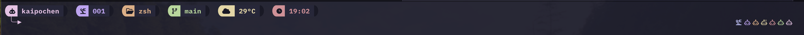

# 🎨 Custom Zsh Prompt Configuration

A beautiful, feature-rich zsh prompt with Catppuccin Macchiato theme, Powerline-style segments, and dynamic weather integration.



## ✨ Features

- **👤 User Information**: Display current username with colorful highlighting
- **🖥️ TTY Display**: Shows current terminal session
- **📁 Directory Path**: Compact current directory display
- **🌿 Git Integration**: Shows current git branch when in a repository
- **🌤️ Weather Display**: Dynamic weather icons with day/night detection
- **🌡️ Temperature**: Current temperature display (requires Apple Shortcuts)
- **🕐 Time**: Current time in 24-hour format
- **🎨 Catppuccin Macchiato**: Beautiful pastel color scheme
- **🔲 Powerline Style**: Rounded corner segments for modern look
- **🌈 Decorative Icons**: Colorful right-side prompt decoration

## 📁 File Structure

```
.config/zsh/
├── prompt/
│   ├── colors.zsh    # Catppuccin Macchiato color definitions
│   ├── symbols.zsh   # Powerline symbols and icons
│   ├── utils.zsh     # Utility functions (git branch, tty)
│   ├── weather.zsh   # Weather and temperature functions
│   └── prompt.zsh    # Main prompt configuration
└── README.md        # This file
```

### File Descriptions

- **`colors.zsh`**: Defines all Catppuccin Macchiato colors (pink, mauve, lavender, etc.)
- **`symbols.zsh`**: Contains Powerline symbols for rounded corners and separators
- **`utils.zsh`**: Helper functions for git branch detection and TTY information
- **`weather.zsh`**: Weather icon mapping with day/night awareness and temperature caching
- **`prompt.zsh`**: Main configuration that assembles all components into the final prompt

## 🔧 Dependencies

### Required

- **Zsh**: Version 5.0 or higher
- **Nerd Font**: Required for icons and Powerline symbols
  - Recommended: [JetBrainsMono Nerd Font](https://github.com/ryanoasis/nerd-fonts/tree/master/patched-fonts/JetBrainsMono)
  - Or any other [Nerd Font](https://www.nerdfonts.com/)

### Optional

- **Apple Shortcuts**: For weather and temperature display (macOS only)
  - Create shortcuts named "Terminal weather" and "Terminal temperature"
- **Git**: For branch display functionality

## 📦 Installation

1. **Clone or download** this configuration to `~/.config/zsh/`:

   ```bash
   git clone <repository-url> ~/.config/zsh
   ```

2. **Install a Nerd Font**:

   ```bash
   # macOS with Homebrew
   brew tap homebrew/cask-fonts
   brew install --cask font-jetbrains-mono-nerd-font
   ```

3. **Source the prompt** in your `~/.zshrc`:

   ```bash
   # Add this line to your ~/.zshrc
   source ~/.config/zsh/prompt/prompt.zsh
   ```

4. **Set up weather shortcuts** (optional, macOS only):
   - Open Shortcuts app
   - Create "Terminal weather" shortcut that returns weather condition text
   - Create "Terminal temperature" shortcut that returns temperature value

5. **Restart your terminal** or run:

   ```bash
   source ~/.zshrc
   ```

## 🎨 Customization

### Changing Colors

Edit `prompt/colors.zsh` to modify the Catppuccin Macchiato colors or replace with your preferred theme:

```bash
# Example: Change pink to a different color
PINK=$'\e[38;2;245;194;231m'  # Original
PINK=$'\e[38;2;255;0;128m'    # Custom hot pink
```

### Modifying Prompt Segments

Edit `prompt/prompt.zsh` to add, remove, or reorder segments:

```bash
# Example: Remove weather segment
# Just delete or comment out the weather segment:
# ${YELLOW}${PL_LEFT_ROUND}${BG_YELLOW} ${BG_BASE}${YELLOW} $(weather)$(temperature) ${BG_RESET}${CRUST}${PL_RIGHT_ROUND}
```

### Changing Icons

Modify icons in `prompt/prompt.zsh`:

- `󰚩` - User icon
- `󰭆` - TTY icon
-  - Directory icon
-  - Git icon
- `󱑁` - Time icon

### Weather Icons

Customize weather icons in `prompt/weather.zsh` by modifying the `get_weather_icon()` function.

## 🐛 Troubleshooting

### Icons not displaying correctly

**Solution**: Ensure you have a Nerd Font installed and your terminal is configured to use it.

### Weather/Temperature not showing

**Solution**:

- Check that Apple Shortcuts are set up correctly
- Verify shortcuts are named exactly "Terminal weather" and "Terminal temperature"
- Check `/tmp/weather_cache` and `/tmp/temperature_cache` for cached data

### Colors look wrong

**Solution**:

- Ensure your terminal supports 24-bit true color
- Popular terminals with true color support: Ghostty, iTerm2, Alacritty, Kitty, WezTerm

### Prompt appears on multiple lines unintentionally

**Solution**: Your terminal might be too narrow. The prompt is designed for wider terminals (100+ columns).

### Git branch not showing

**Solution**:

- Ensure git is installed: `which git`
- Check that you're in a git repository: `git status`

## 🤝 Contributing

Feel free to submit issues and enhancement requests!

## 📄 License

This configuration is provided as-is for personal use. Feel free to modify and share!

## 🙏 Acknowledgments

- [Catppuccin](https://github.com/catppuccin/catppuccin) for the beautiful color scheme
- [Powerline](https://github.com/powerline/powerline) for the segment design inspiration
- [Nerd Fonts](https://www.nerdfonts.com/) for the amazing icon collection

